<!--
Plain Markdown only (no Liquid), so this file also renders outside the site.
Media goes in website/images/assignment-1/ and is referenced as ../images/assignment-1/<file>.

Image:

Image with caption:
<figure>
  
  <figcaption>Taken from about 3 m with zoom.</figcaption>
</figure>

Side by side (columns adapt to the number of figures):

  <figure><figcaption>Close, wide</figcaption></figure>
  <figure><figcaption>Far, zoomed</figcaption></figure>

GIF: same as an image. Video (the poster frame is what prints to PDF):
<video src="../images/assignment-1/dolly.mp4" poster="../images/assignment-1/dolly.jpg" controls loop muted playsinline></video>

Math: $$ \text{NCC} = \frac{a}{\|a\|} \cdot \frac{b}{\|b\|} $$
-->

## 1. Overview

Sergei Prokudin-Gorskii (1863-1944) was convinced early on that colour photography was the future. He travelled across the Russian Empire photographing people, buildings, landscapes, and railways. He recorded every scene as three black-and-white exposures on a single glass plate, taken through blue, green, and red filters and stacked top to bottom. There was no way to print colour photographs at the time. The Library of Congress bought the plates in 1948 and has since digitized them.

The goal of this assignment is to turn a digitized plate into a single colour image automatically, with as few visual artifacts as possible. Each plate is split into three equal parts (B, G, R), and the G and R channels are aligned to B. The alignment model is a pure x, y translation: for each channel, find the shift that makes it line up with the blue channel.

The data set has 12 small plates (about 400 x 1024 px, so each channel is about 400 x 341) and 6 full-size scans (about 3700 x 9700 px, channels about 3700 x 3230). Two things make the alignment harder than it sounds:

- The channels were exposed separately, so the same object has a different brightness in each one.
- The plate borders are damaged and uneven, and they don't line up across channels.

To deal with the borders, every method scores a match only on the interior of the channels: a fraction of each side is cropped away before comparing. The crop only affects scoring; the output image keeps the full frame.

The approaches, from simplest to most involved:

| Approach | Idea | Script |
|----------|------|--------|
| Baseline | Stack the three channels without any alignment | `baseline.py` |
| Single-scale L2 / NCC | Try every shift in a window and keep the one with the best L2 (Euclidean distance) or NCC score | `l2_ncc.py` |
| Image pyramid | Search at low resolution first, then refine the estimate at each finer scale | `img_pyramid.py` |
| Edge-based alignment | Align Sobel or Canny edge maps instead of raw brightness | `edges.py` |
| Phase correlation | Estimate the shift in one step from the phase of the Fourier transform of the edge maps | `phase_cor.py` |

All of the code is in `Assignment 1/src/`.

## 2. Baseline: No Alignment

Stacking the channels exactly as they come off the plate shows how far apart they are: every object appears as offset red, green, and blue copies. On the small plates the red channel is off by up to 18 px vertically. On the full-size scans it is off by up to about 160 px.

### Small plates

  <figure><figcaption>00056v</figcaption></figure>
  <figure>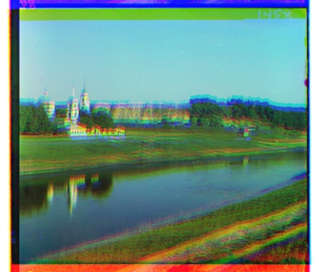<figcaption>00125v</figcaption></figure>
  <figure>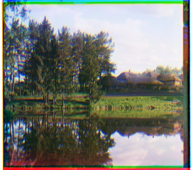<figcaption>00163v</figcaption></figure>
  <figure><figcaption>00804v</figcaption></figure>
  <figure>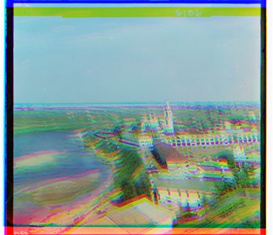<figcaption>01164v</figcaption></figure>
  <figure>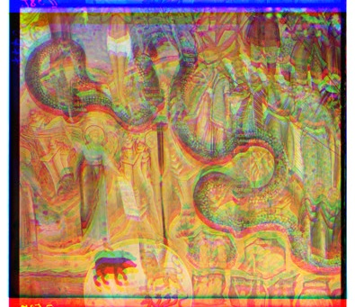<figcaption>01269v</figcaption></figure>
  <figure>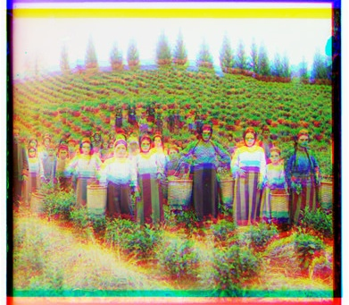<figcaption>01522v</figcaption></figure>
  <figure>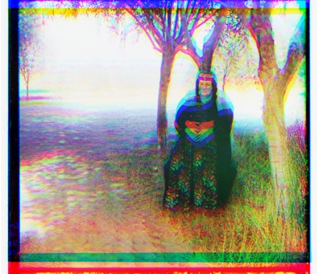<figcaption>01597v</figcaption></figure>
  <figure>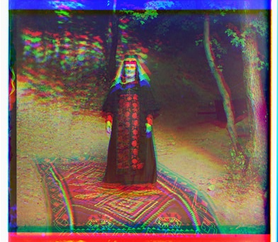<figcaption>01598v</figcaption></figure>
  <figure>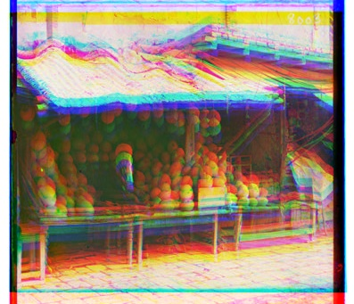<figcaption>01728v</figcaption></figure>
  <figure>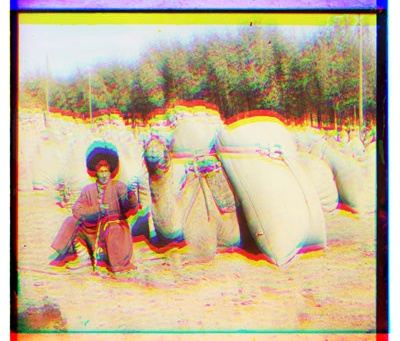<figcaption>10131v</figcaption></figure>
  <figure><figcaption>31421v</figcaption></figure>

### Full-size plates

The full-size images are scaled down for the web.

  <figure><figcaption>00458u</figcaption></figure>
  <figure>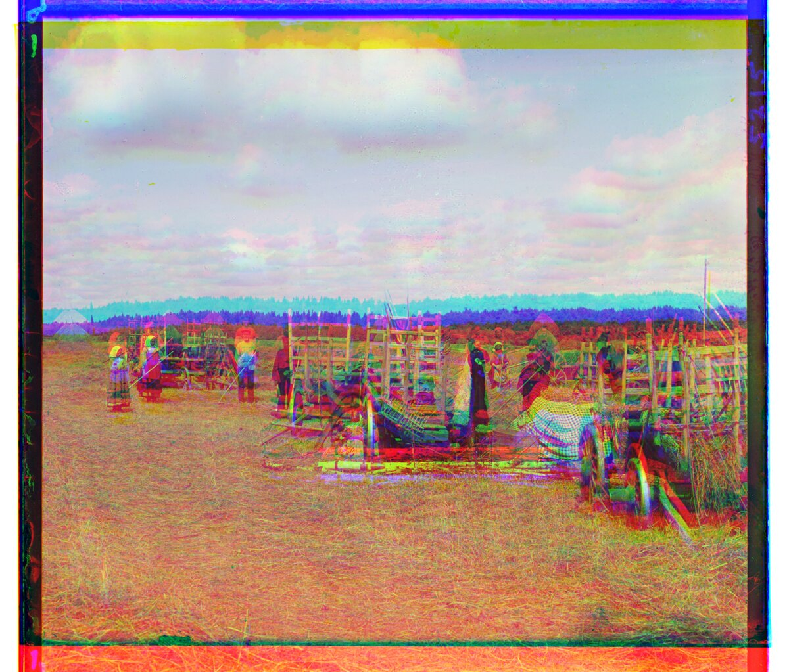<figcaption>01007a</figcaption></figure>
  <figure>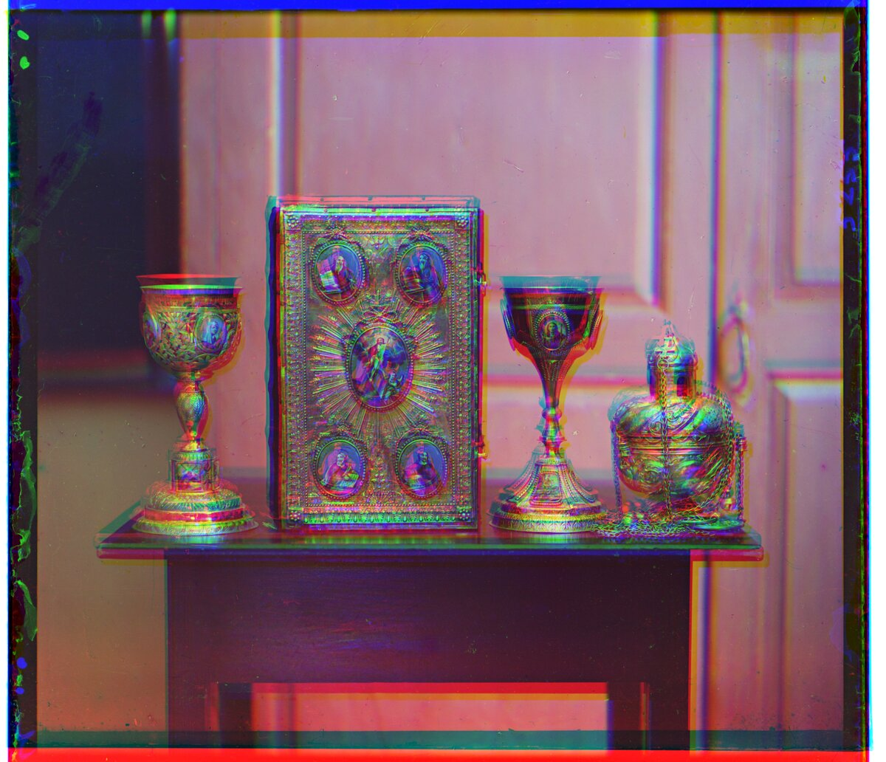<figcaption>01047u</figcaption></figure>
  <figure><figcaption>01657u</figcaption></figure>
  <figure><figcaption>01725u</figcaption></figure>
  <figure>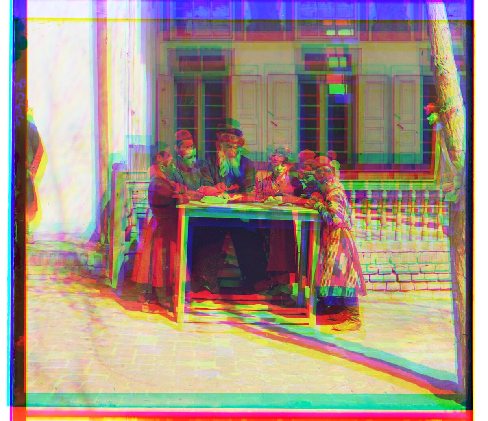<figcaption>01861a</figcaption></figure>

## 3. Single-Scale L2 and NCC

The simplest alignment is an exhaustive search: shift the G (or R) channel by every (dx, dy) in a window, score how well it matches B, and keep the best shift. Two scores are used.

**L2 norm (Euclidean distance)**, lower is better:

$$ L_2(a, b) = \lVert a - b \rVert_2 = \sqrt{\sum_{x, y} \big(a(x, y) - b(x, y)\big)^2} $$

**Normalized cross-correlation (NCC)**, higher is better. The mean of each channel is subtracted first, which makes it insensitive to brightness and contrast differences between the channels:

$$ \text{NCC}(a, b) = \frac{(a - \bar{a}) \cdot (b - \bar{b})}{\lVert a - \bar{a} \rVert \, \lVert b - \bar{b} \rVert} $$

Settings:

- **Search window:** [-20, 20] px in x and y. The suggested [-15, 15] was too small: for 01597v, 01598v, and 01728v the best red shift sat right on the edge of that window (y = 15). With [-20, 20] they land at 16 to 18.
- **Crop:** 10% of each side is ignored when scoring.
- **Plates:** only the 12 small plates. On the full-size scans the offsets are about ten times larger, so the search would need a window of about ±160 px on 3700 x 3230 px channels. That is what the image pyramid is for.

Offsets below are the (x, y) shift in pixels applied to the G or R channel to line it up with B (positive x is right, positive y is down). Times are for aligning both channels.

#### 00056v

  <figure><figcaption>Baseline</figcaption></figure>
  <figure>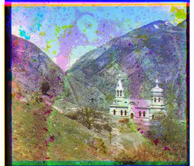<figcaption>L2: G (1, 6), R (1, 13), 0.6 s</figcaption></figure>
  <figure><figcaption>NCC: G (1, 6), R (1, 13), 1.5 s</figcaption></figure>

#### 00125v

  <figure><figcaption>Baseline</figcaption></figure>
  <figure><figcaption>L2: G (2, 5), R (1, 10), 0.5 s</figcaption></figure>
  <figure>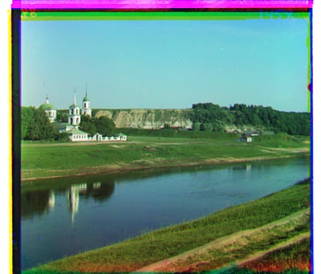<figcaption>NCC: G (2, 5), R (1, 10), 1.2 s</figcaption></figure>

#### 00163v

  <figure><figcaption>Baseline</figcaption></figure>
  <figure>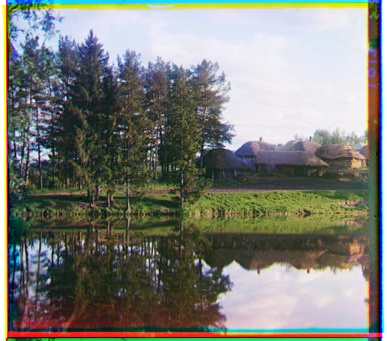<figcaption>L2: G (1, -3), R (1, -4), 0.5 s</figcaption></figure>
  <figure><figcaption>NCC: G (1, -3), R (1, -4), 1.1 s</figcaption></figure>

#### 00804v

  <figure><figcaption>Baseline</figcaption></figure>
  <figure><figcaption>L2: G (-2, 6), R (-4, 13), 0.5 s</figcaption></figure>
  <figure><figcaption>NCC: G (-2, 6), R (-4, 13), 1.2 s</figcaption></figure>

#### 01164v

  <figure><figcaption>Baseline</figcaption></figure>
  <figure><figcaption>L2: G (2, 6), R (3, 11), 0.4 s</figcaption></figure>
  <figure>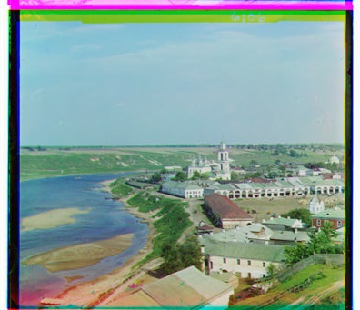<figcaption>NCC: G (2, 6), R (3, 11), 1.1 s</figcaption></figure>

#### 01269v

  <figure><figcaption>Baseline</figcaption></figure>
  <figure>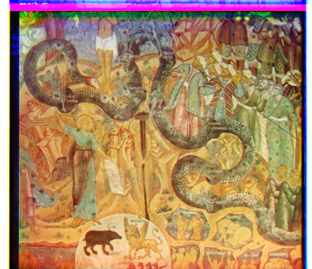<figcaption>L2: G (2, 6), R (3, 14), 0.4 s</figcaption></figure>
  <figure><figcaption>NCC: G (2, 6), R (3, 13), 1.1 s</figcaption></figure>

#### 01522v

  <figure><figcaption>Baseline</figcaption></figure>
  <figure>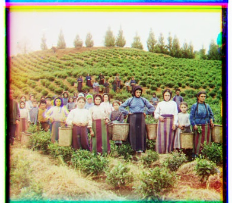<figcaption>L2: G (2, 6), R (1, 13), 0.5 s</figcaption></figure>
  <figure>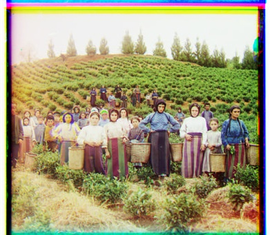<figcaption>NCC: G (2, 6), R (2, 13), 1.1 s</figcaption></figure>

#### 01597v

  <figure><figcaption>Baseline</figcaption></figure>
  <figure>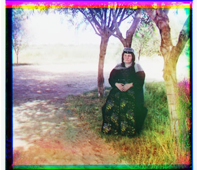<figcaption>L2: G (1, 7), R (1, 16), 0.4 s</figcaption></figure>
  <figure><figcaption>NCC: G (1, 7), R (1, 16), 1.2 s</figcaption></figure>

#### 01598v

  <figure><figcaption>Baseline</figcaption></figure>
  <figure>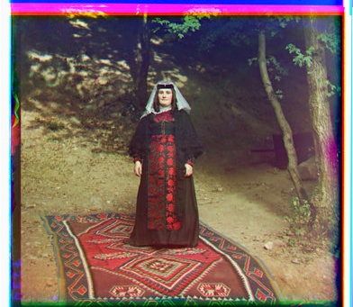<figcaption>L2: G (0, 8), R (-1, 17), 0.5 s</figcaption></figure>
  <figure><figcaption>NCC: G (0, 8), R (-1, 16), 1.2 s</figcaption></figure>

#### 01728v

  <figure><figcaption>Baseline</figcaption></figure>
  <figure><figcaption>L2: G (1, 8), R (1, 18), 0.4 s</figcaption></figure>
  <figure>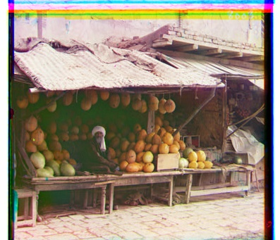<figcaption>NCC: G (1, 8), R (1, 18), 1.1 s</figcaption></figure>

#### 10131v

  <figure><figcaption>Baseline</figcaption></figure>
  <figure>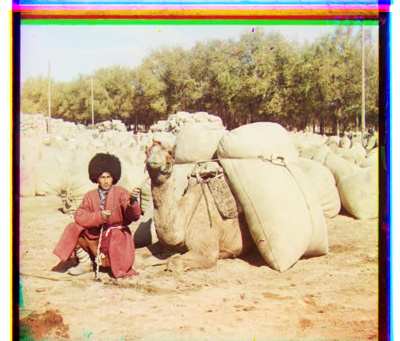<figcaption>L2: G (2, 6), R (3, 12), 0.5 s</figcaption></figure>
  <figure><figcaption>NCC: G (2, 6), R (3, 12), 1.2 s</figcaption></figure>

#### 31421v

  <figure><figcaption>Baseline</figcaption></figure>
  <figure><figcaption>L2: G (0, 8), R (0, 13), 0.4 s</figcaption></figure>
  <figure><figcaption>NCC: G (0, 8), R (0, 13), 1.2 s</figcaption></figure>

Observations:

- Both metrics align all 12 small plates. They agree exactly on 9 of them and differ by 1 px in the red channel on 01269v, 01522v, and 01598v, which is not visible at this size.
- L2 is about 2.6 times faster than NCC here (about 0.5 s versus 1.2 s per plate), because NCC also subtracts the means and normalizes at every shift.
- The coloured strips along the edges are the plate borders, which don't line up across channels, plus a few rows that wrap around when a channel is shifted. Removing them automatically is one of the bells & whistles.

<!--
Still to write:

## 4. Image Pyramid
## 5. Edge-Based Alignment (Sobel and Canny)
## 6. Phase Correlation
## 7. Bells & Whistles

## Part 1: Becoming Friends with Your Camera
### Selfie: The Wrong Way vs. The Right Way
### Architectural Perspective Compression
### The Dolly Zoom
-->
