<!--
Plain Markdown only (no Liquid), so this file also renders outside the site.
Media goes in website/images/assignment-1/ and is referenced as ../images/assignment-1/<file>.

Image:

Image with caption:
<figure>
  
  <figcaption>Taken from about 3 m with zoom.</figcaption>
</figure>

Side by side (columns adapt to the number of figures):

  <figure><figcaption>Close, wide</figcaption></figure>
  <figure><figcaption>Far, zoomed</figcaption></figure>

GIF: same as an image. Video (the poster frame is what prints to PDF):
<video src="../images/assignment-1/dolly.mp4" poster="../images/assignment-1/dolly.jpg" controls loop muted playsinline></video>

Math: $$ \text{NCC} = \frac{a}{\|a\|} \cdot \frac{b}{\|b\|} $$
-->

## 0. Fun Stuff

### Dolly Zoom

A dolly zoom (the "Vertigo shot") moves the camera toward or away from the subject while zooming, so the subject stays the same size in the frame and the background seems to stretch or compress around it.

It works because zooming and moving do different things. An object's size in the image is proportional to $$ f / d $$, its focal length over its distance from the camera. Zooming changes $$ f $$ for everything equally, so it only scales the whole picture. Moving changes $$ d $$, and changes it by a larger fraction for near objects than for far ones. Keeping $$ f / d $$ fixed for the subject holds it steady, but the background, which is much farther away, changes size as the camera moves.

In this clip the camera moves in and zooms out over the first 6 seconds, so the van behind the subject shrinks. Over the last 6 seconds it backs away and zooms in, and the van grows back, while the subject stays about the same size throughout.

<figure>
  <video src="../images/assignment-1/dolly_zoom/dolly_zoom.mp4" poster="../images/assignment-1/dolly_zoom/dolly_zoom_poster.jpg" controls loop muted playsinline></video>
  <figcaption>Dolly zoom, 12 s</figcaption>
</figure>

Stills from the first half of the clip:

  <figure>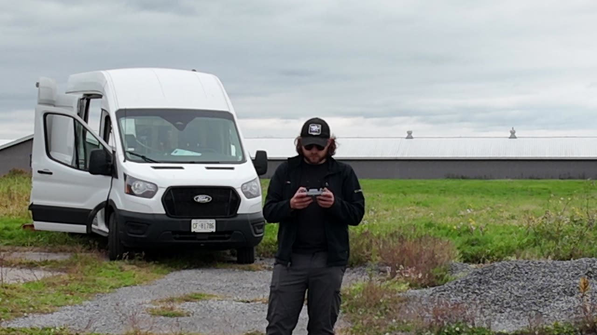<figcaption>0 s: camera far, zoomed in</figcaption></figure>
  <figure>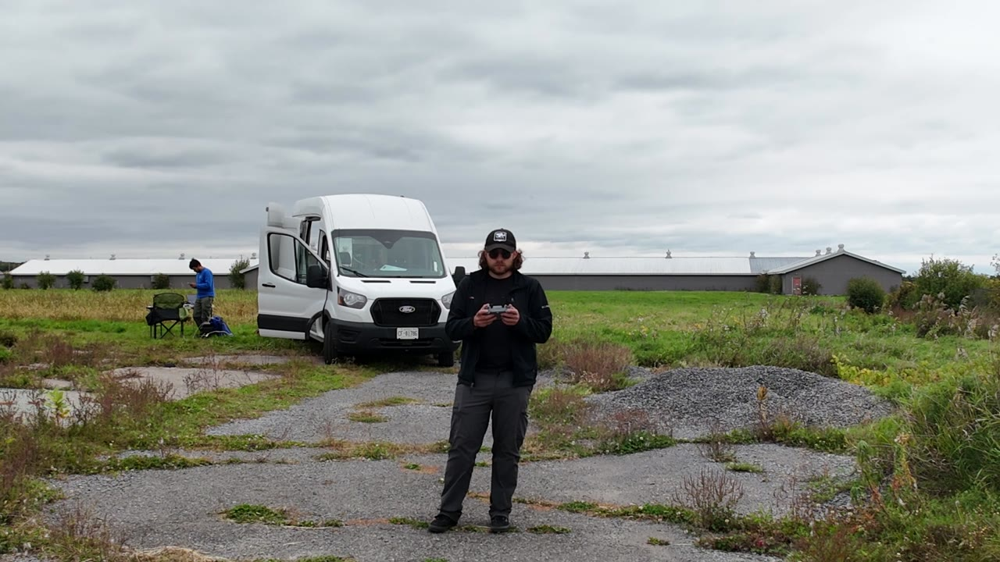<figcaption>3 s</figcaption></figure>
  <figure>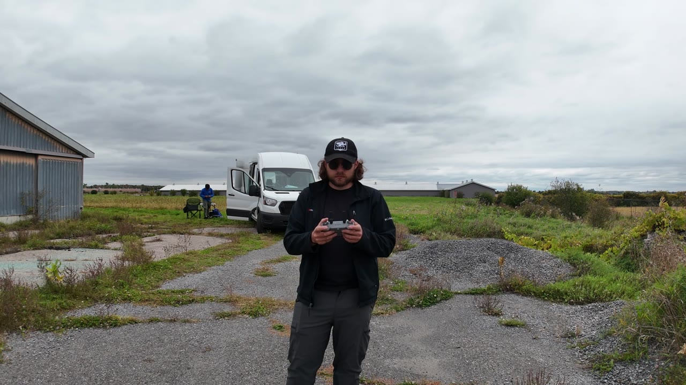<figcaption>6 s: camera close, zoomed out</figcaption></figure>

## 1. Overview

Sergei Prokudin-Gorskii (1863-1944) was convinced early on that colour photography was the future. He travelled across the Russian Empire photographing people, buildings, landscapes, and railways. He recorded every scene as three black-and-white exposures on a single glass plate, taken through blue, green, and red filters and stacked top to bottom. There was no way to print colour photographs at the time. The Library of Congress bought the plates in 1948 and has since digitized them.

The goal of this assignment is to turn a digitized plate into a single colour image automatically, with as few visual artifacts as possible. Each plate is split into three equal parts (B, G, R), and the G and R channels are aligned to B. The alignment model is a pure x, y translation: for each channel, find the shift that makes it line up with the blue channel.

The data set has 12 small plates (about 400 x 1024 px, so each channel is about 400 x 341) and 6 full-size scans (about 3700 x 9700 px, channels about 3700 x 3230). Every method was run on all of them. To keep the page manageable, images are shown for six plates: 00056v, 00804v, and 31421v (small) and 00458u, 01657u, and 01725u (full-size). The results tables in section 7 only include these six plates.

Two things make the alignment harder than it sounds:

- The channels were exposed separately, so the same object has a different brightness in each one.
- The plate borders are damaged and uneven, and they don't line up across channels.

To deal with the borders, every method scores a match only on the interior of the channels: a fraction of each side is cropped away before comparing. The crop only affects scoring; the output image keeps the full frame.

The approaches, from simplest to most involved:

| Approach | Idea | Script |
|----------|------|--------|
| Baseline | Stack the three channels without any alignment | `baseline.py` |
| Single-scale L2 / NCC | Try every shift in a window and keep the one with the best L2 (Euclidean distance) or NCC score | `l2_ncc.py` |
| Image pyramid | Search at low resolution first, then refine the estimate at each finer scale | `img_pyramid.py` |
| Edge-based alignment | Align Sobel or Canny edge maps instead of raw brightness | `edges.py` |
| Phase correlation | Estimate the shift in one step from the phase of the Fourier transform of the edge maps | `phase_cor.py` |

Sections 8 to 11 add four automatic enhancements (cropping, contrast, white balance, and colour mapping), each applied to the best alignment. All of the code is in `Assignment 1/src/`.

## 2. Baseline: No Alignment

Stacking the channels exactly as they come off the plate shows how far apart they are: every object appears as offset red, green, and blue copies. On the small plates the red channel is off by up to 18 px vertically. On the full-size scans it is off by up to about 160 px.

### Small plates

  <figure>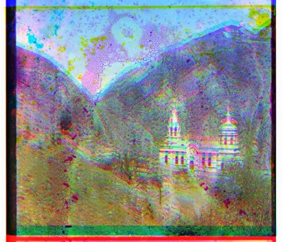<figcaption>00056v</figcaption></figure>
  <figure>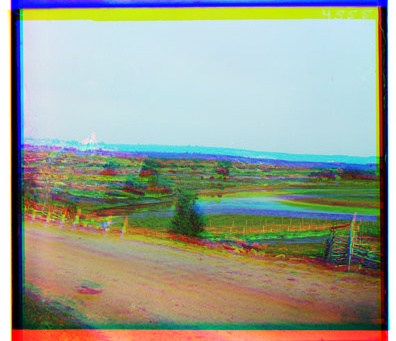<figcaption>00804v</figcaption></figure>
  <figure>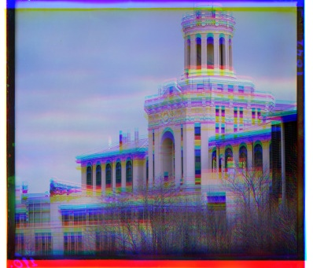<figcaption>31421v</figcaption></figure>

### Full-size plates

The full-size images are scaled down for the web.

  <figure>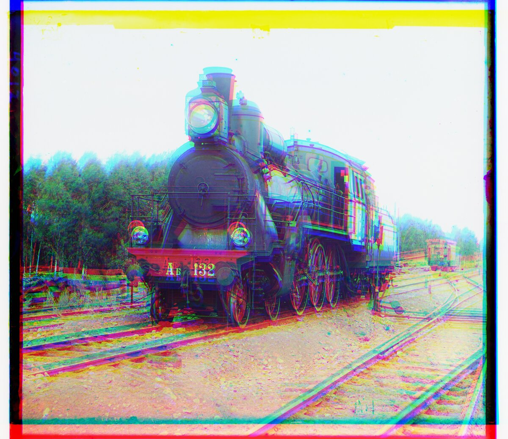<figcaption>00458u</figcaption></figure>
  <figure>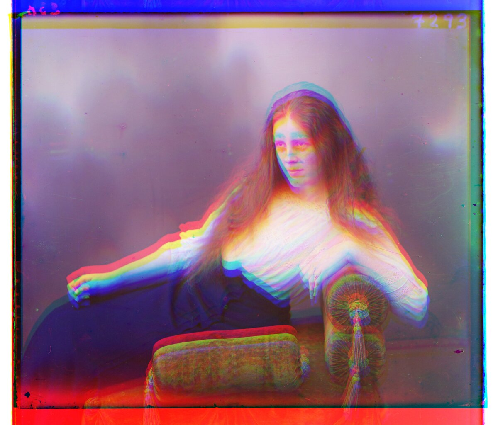<figcaption>01657u</figcaption></figure>
  <figure>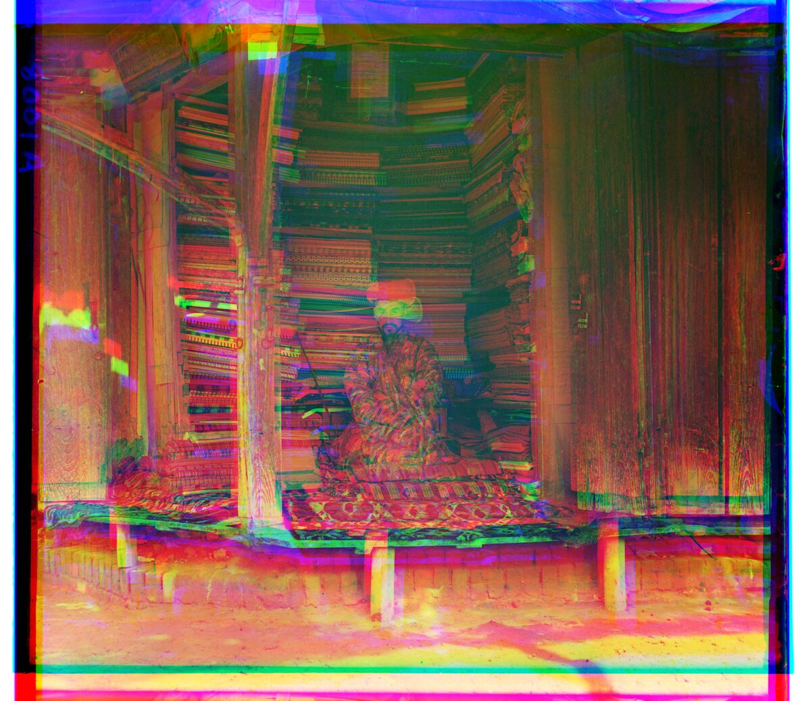<figcaption>01725u</figcaption></figure>

## 3. Single-Scale L2 and NCC

The simplest alignment is an exhaustive search: shift the G (or R) channel by every (dx, dy) in a window, score how well it matches B, and keep the best shift. Two scores are used.

**L2 norm (Euclidean distance)**, lower is better:

$$ L_2(a, b) = \lVert a - b \rVert_2 = \sqrt{\sum_{x, y} \big(a(x, y) - b(x, y)\big)^2} $$

**Normalized cross-correlation (NCC)**, higher is better. The mean of each channel is subtracted first, which makes it insensitive to brightness and contrast differences between the channels:

$$ \text{NCC}(a, b) = \frac{(a - \bar{a}) \cdot (b - \bar{b})}{\lVert a - \bar{a} \rVert \, \lVert b - \bar{b} \rVert} $$

Settings:

- **Search window:** [-20, 20] px in x and y. The suggested [-15, 15] was too small: for 01597v, 01598v, and 01728v the best red shift sat right on the edge of that window (y = 15). With [-20, 20] they land at 16 to 18.
- **Crop:** 10% of each side is ignored when scoring.
- **Plates:** only the 12 small plates. On the full-size scans the offsets are about ten times larger, so the search would need a window of about ±160 px on 3700 x 3230 px channels. That is what the image pyramid is for.

Offsets below are the (x, y) shift in pixels applied to the G or R channel to line it up with B (positive x is right, positive y is down). Times are for aligning both channels.

#### 00056v

  <figure><figcaption>Baseline</figcaption></figure>
  <figure><figcaption>L2: G (1, 6), R (1, 13), 0.6 s</figcaption></figure>
  <figure><figcaption>NCC: G (1, 6), R (1, 13), 1.5 s</figcaption></figure>

#### 00804v

  <figure><figcaption>Baseline</figcaption></figure>
  <figure><figcaption>L2: G (-2, 6), R (-4, 13), 0.5 s</figcaption></figure>
  <figure>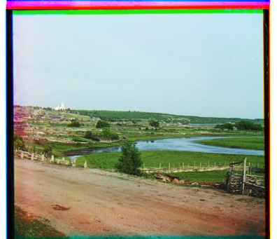<figcaption>NCC: G (-2, 6), R (-4, 13), 1.2 s</figcaption></figure>

#### 31421v

  <figure><figcaption>Baseline</figcaption></figure>
  <figure><figcaption>L2: G (0, 8), R (0, 13), 0.4 s</figcaption></figure>
  <figure><figcaption>NCC: G (0, 8), R (0, 13), 1.2 s</figcaption></figure>

Observations:

- Both metrics align all 12 small plates. They agree exactly on 9 of them and differ by 1 px in the red channel on 01269v, 01522v, and 01598v, which is not visible at this size.
- L2 is about 2.6 times faster than NCC here (about 0.5 s versus 1.2 s per plate), because NCC also subtracts the means and normalizes at every shift.
- The coloured strips along the edges are the plate borders, which don't line up across channels, plus a few rows that wrap around when a channel is shifted. Removing them automatically is one of the bells & whistles.

## 4. Image Pyramid

Single-scale search does not scale to the full-size scans. Their offsets reach 162 px, so the window would need to be about ±160 px: over 100,000 candidate shifts per channel, each scored on a 3700 x 3230 px image.

The image pyramid searches coarse to fine instead:

1. Halve the channel repeatedly by averaging each 2x2 block of pixels (a box filter, so fine detail doesn't alias) until the smaller side is at most 500 px. The full-size scans are halved 3 times (3230, 1615, 807, 403 px). The small plates are already under 500 px, so for them this is a plain single-scale search.
2. At the coarsest level, run the single-scale search with a window of ±25 px. After 3 halvings that covers ±200 px at full resolution.
3. Go back up one level at a time: double the current estimate and refine it with a ±2 px search.

This is a recursive wrapper around the single-scale search from section 3, with the same L2 and NCC scores.

This section uses a 20% crop instead of 10%. With 10%, L2 put the red channel of 01269v at (-25, 25), a corner of the search window, while NCC found the right answer: the wider window lets L2 lock onto the plate borders. A 20% crop fixes it and changes every other offset by at most 2 px.

Only the full-size plates are shown here. The small plates are under 500 px, so for them the pyramid is the same single-scale search as section 3.

#### 00458u (full-size)

  <figure><figcaption>Baseline</figcaption></figure>
  <figure><figcaption>L2: G (6, 43), R (32, 87), 2.3 s</figcaption></figure>
  <figure><figcaption>NCC: G (6, 42), R (32, 87), 4.4 s</figcaption></figure>

#### 01657u (full-size)

  <figure><figcaption>Baseline</figcaption></figure>
  <figure>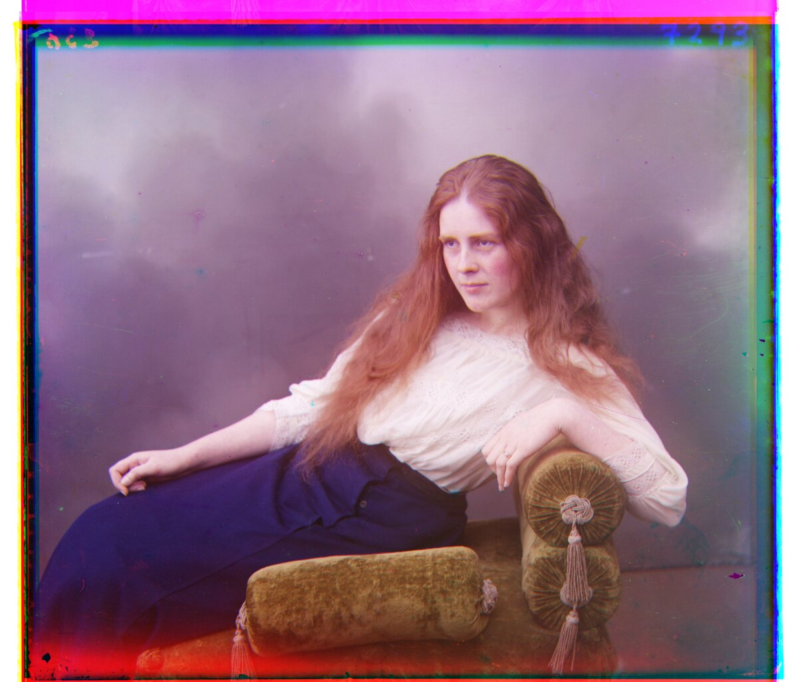<figcaption>L2: G (8, 55), R (12, 114), 2.4 s</figcaption></figure>
  <figure><figcaption>NCC: G (9, 54), R (12, 116), 4.5 s</figcaption></figure>

#### 01725u (full-size)

  <figure><figcaption>Baseline</figcaption></figure>
  <figure><figcaption>L2: G (45, 77), R (77, 162), 2.3 s</figcaption></figure>
  <figure><figcaption>NCC: G (45, 77), R (78, 161), 4.4 s</figcaption></figure>

Observations:

- All 18 plates align with both scores. L2 and NCC agree to within 2 px, which is not visible on a 3700 px wide image.
- A full-size plate takes about 2.3 s with L2 and 4.5 s with NCC.

## 5. Edge-Based Alignment

The channels record different brightness for the same object: something bright in the blue channel can be dark in the red one, and that can pull a brightness-based score off. Edges, the places where brightness changes, tend to sit in the same place in every channel even when the brightness itself doesn't match. This method computes an edge map for each channel, aligns the edge maps with the pyramid from section 4, and then applies the shifts to the original channels.

Two edge detectors were run separately, both after a Gaussian blur with $$ \sigma = 2 $$ px:

- **Sobel:** the gradient magnitude at every pixel, a continuous value, where $$ S_x $$ and $$ S_y $$ are the horizontal and vertical Sobel kernels:

  $$ \lvert \nabla I \rvert = \sqrt{(S_x * I)^2 + (S_y * I)^2} $$

- **Canny:** thin, binary (on or off) edge lines. It keeps only the local maxima of the gradient and links them using two thresholds, set here at the 80th and 90th percentile of the gradient magnitude so they adapt to each plate.

The pyramid settings are the same as in section 4 (window ±25 px, refine ±2 px, crop 20%). Times include edge detection.

### Sobel

#### 00056v

  <figure>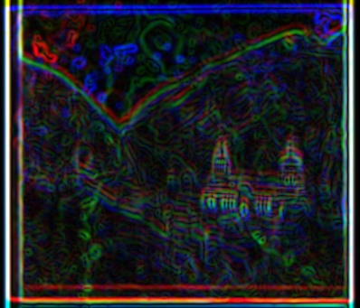<figcaption>Sobel edges, 0.0 s</figcaption></figure>
  <figure><figcaption>L2: G (1, 5), R (1, 13), 0.5 s</figcaption></figure>
  <figure><figcaption>NCC: G (1, 5), R (1, 13), 1.2 s</figcaption></figure>

#### 00804v

  <figure>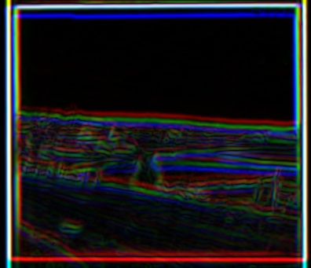<figcaption>Sobel edges, 0.0 s</figcaption></figure>
  <figure><figcaption>L2: G (-2, 6), R (-4, 13), 0.5 s</figcaption></figure>
  <figure><figcaption>NCC: G (-2, 6), R (-4, 13), 1.2 s</figcaption></figure>

#### 31421v

  <figure>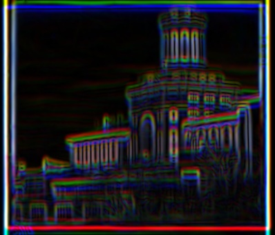<figcaption>Sobel edges, 0.0 s</figcaption></figure>
  <figure><figcaption>L2: G (0, 8), R (0, 14), 0.5 s</figcaption></figure>
  <figure><figcaption>NCC: G (0, 8), R (0, 14), 1.1 s</figcaption></figure>

#### 00458u (full-size)

  <figure>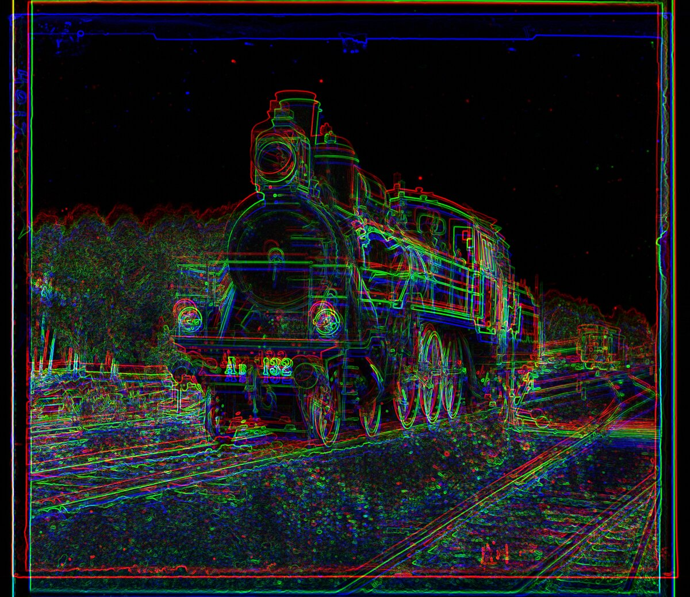<figcaption>Sobel edges, 1.6 s</figcaption></figure>
  <figure><figcaption>L2: G (8, 43), R (33, 86), 4.0 s</figcaption></figure>
  <figure><figcaption>NCC: G (8, 43), R (33, 86), 6.1 s</figcaption></figure>

#### 01657u (full-size)

  <figure>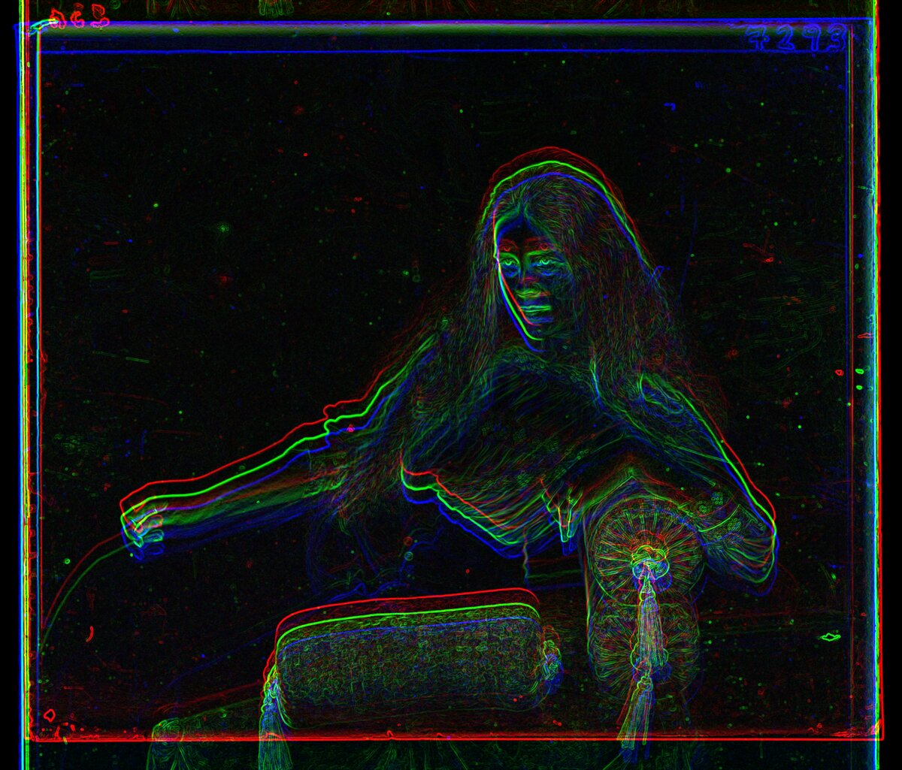<figcaption>Sobel edges, 1.6 s</figcaption></figure>
  <figure><figcaption>L2: G (9, 55), R (13, 117), 4.0 s</figcaption></figure>
  <figure><figcaption>NCC: G (9, 55), R (13, 117), 6.1 s</figcaption></figure>

#### 01725u (full-size)

  <figure>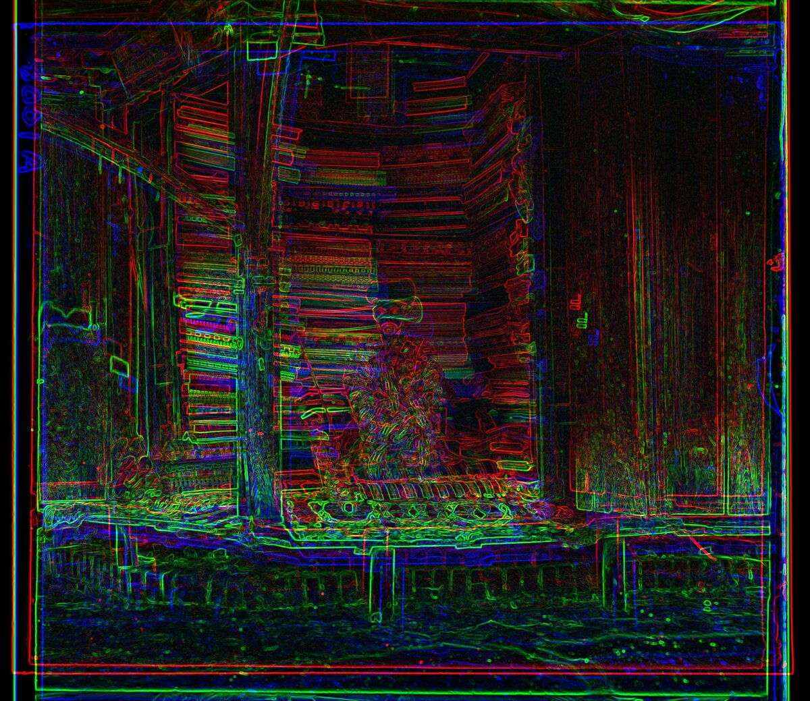<figcaption>Sobel edges, 1.7 s</figcaption></figure>
  <figure><figcaption>L2: G (44, 77), R (77, 161), 4.0 s</figcaption></figure>
  <figure>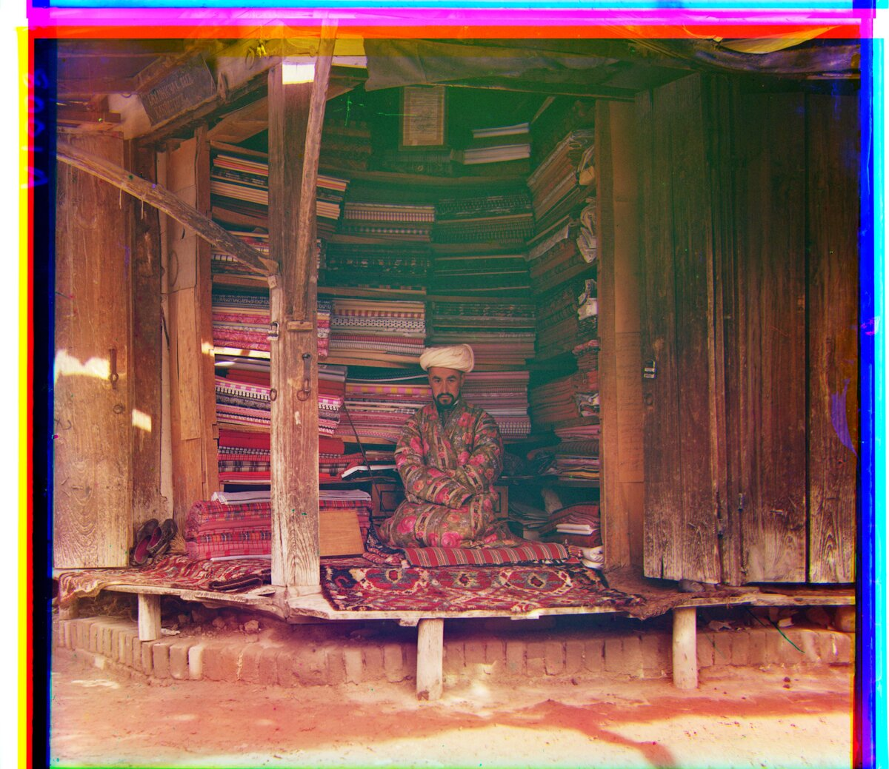<figcaption>NCC: G (44, 77), R (77, 161), 6.2 s</figcaption></figure>

Observations:

- All 18 plates align, and L2 and NCC agree exactly on every plate.
- The offsets are within 3 px of the brightness-based pyramid in section 4.
- Edge detection adds about 1.6 s per full-size plate.

### Canny

#### 00056v

  <figure>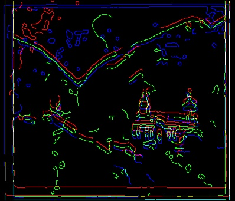<figcaption>Canny edges, 0.0 s</figcaption></figure>
  <figure><figcaption>L2: G (1, 5), R (0, 13), 0.5 s</figcaption></figure>
  <figure>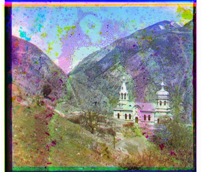<figcaption>NCC: G (1, 5), R (0, 13), 1.1 s</figcaption></figure>

#### 00804v

  <figure>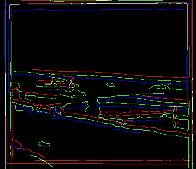<figcaption>Canny edges, 0.0 s</figcaption></figure>
  <figure><figcaption>L2: G (-2, 6), R (-4, 13), 0.5 s</figcaption></figure>
  <figure><figcaption>NCC: G (-2, 6), R (-4, 13), 1.2 s</figcaption></figure>

#### 31421v

  <figure>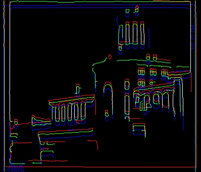<figcaption>Canny edges, 0.0 s</figcaption></figure>
  <figure><figcaption>L2: G (0, 8), R (0, 13), 0.5 s</figcaption></figure>
  <figure><figcaption>NCC: G (0, 8), R (0, 13), 1.2 s</figcaption></figure>

#### 00458u (full-size)

  <figure>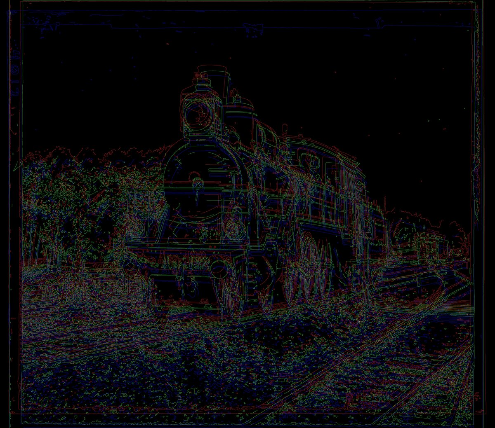<figcaption>Canny edges, 3.3 s</figcaption></figure>
  <figure><figcaption>L2: G (9, 41), R (34, 85), 5.7 s</figcaption></figure>
  <figure><figcaption>NCC: G (9, 41), R (34, 85), 7.8 s</figcaption></figure>

#### 01657u (full-size)

  <figure>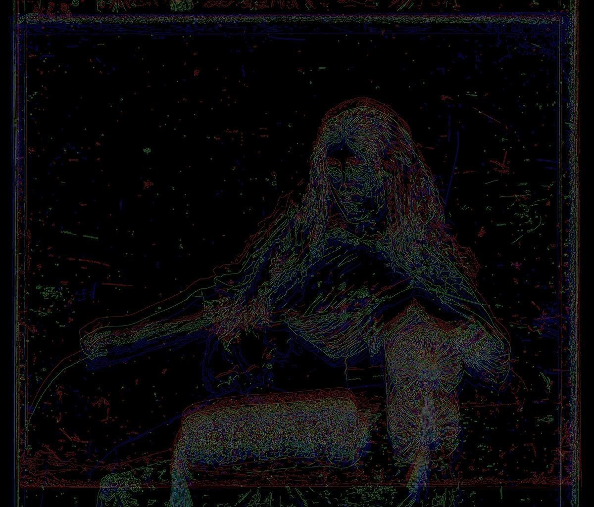<figcaption>Canny edges, 3.4 s</figcaption></figure>
  <figure><figcaption>L2: G (9, 56), R (13, 120), 5.8 s</figcaption></figure>
  <figure><figcaption>NCC: G (9, 56), R (13, 120), 7.9 s</figcaption></figure>

#### 01725u (full-size)

  <figure>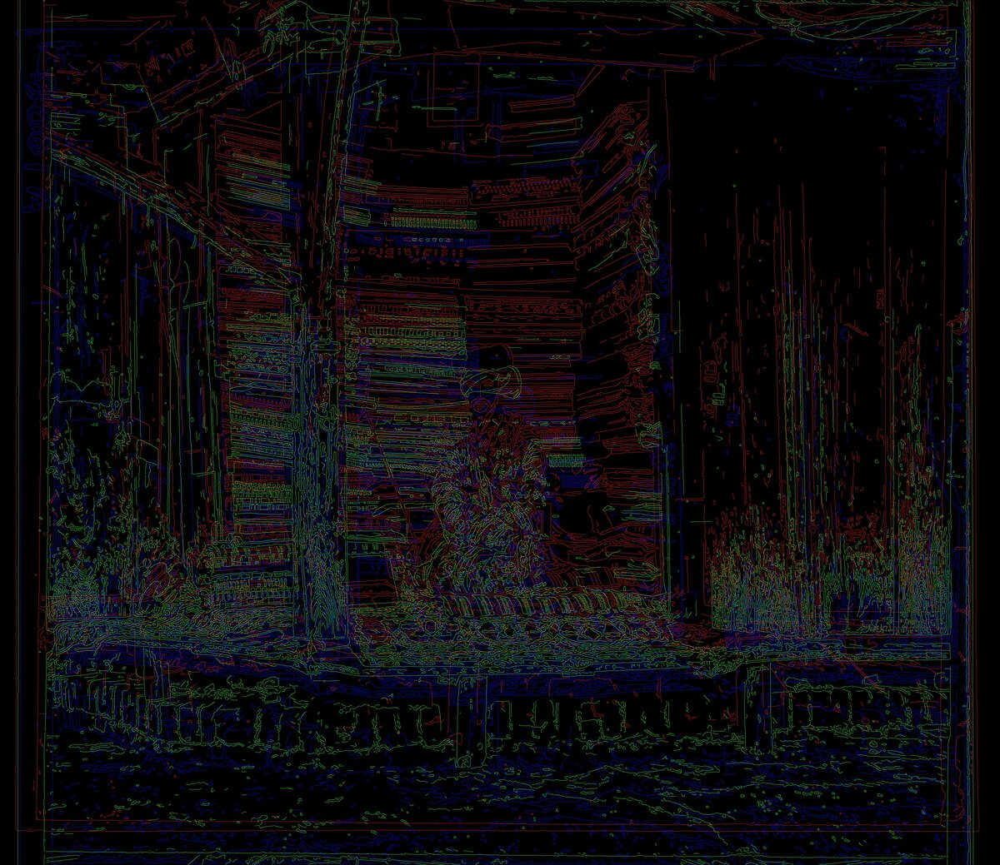<figcaption>Canny edges, 3.4 s</figcaption></figure>
  <figure><figcaption>L2: G (44, 75), R (76, 160), 5.7 s</figcaption></figure>
  <figure><figcaption>NCC: G (44, 75), R (76, 160), 7.8 s</figcaption></figure>

Observations:

- 01269v fails: the red channel lands at (24, 25) with L2 and (18, -21) with NCC, instead of about (3, 14). In its edge map the three channels' edges barely overlap (the blue edges sit mostly in the foliage), so there is no clear best match.
- On the full-size plates the offsets are 1 to 3 px off Sobel, which shows as green and magenta fringing in full-resolution crops of 01047u and 01861a.
- Canny is sensitive to the blur. With $$ \sigma = 1 $$ px it aligns 01269v correctly, but no value from 1 to 4 fixed the green channel of 01047u. Sobel worked on every plate with one setting.
- Edge detection takes about 3.3 s per full-size plate, twice as long as Sobel.

## 6. Phase Correlation

Phase correlation finds the shift in one step instead of searching for it. Shifting an image only changes the phase of its Fourier transform, so the normalized cross-power spectrum of two shifted copies is a pure phase term, and its inverse Fourier transform is a single sharp peak at the shift:

$$ R = \frac{F_B \, \overline{F_C}}{\lvert F_B \, \overline{F_C} \rvert}, \qquad (d_x, d_y) = \arg\max_{x, y} \, \mathcal{F}^{-1}\{R\}(x, y) $$

Here $$ F_B $$ and $$ F_C $$ are the Fourier transforms of the blue channel and the channel being aligned. It runs on the same Sobel and Canny edge maps as section 5:

1. Crop 20% from each side and subtract the mean.
2. Multiply by a Hann window, which fades the image to zero at its edges. The Fourier transform treats the image as repeating, so without the window the jump where it wraps around would add false edges.
3. Take the location of the peak. Peaks past the midpoint are negative shifts, because the transform wraps around.

There is no search window, so large offsets cost nothing extra. The height of the peak works as a rough confidence score.

### Sobel

#### 00056v

  <figure><figcaption>Sobel edges</figcaption></figure>
  <figure><figcaption>Phase: G (1, 5), R (1, 13), 0.1 s, peaks 0.237 / 0.224</figcaption></figure>

#### 00804v

  <figure><figcaption>Sobel edges</figcaption></figure>
  <figure>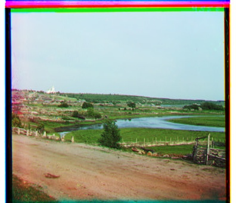<figcaption>Phase: G (-2, 5), R (-4, 13), 0.0 s, peaks 0.346 / 0.327</figcaption></figure>

#### 31421v

  <figure><figcaption>Sobel edges</figcaption></figure>
  <figure><figcaption>Phase: G (0, 9), R (0, 14), 0.0 s, peaks 0.518 / 0.443</figcaption></figure>

#### 00458u (full-size)

  <figure><figcaption>Sobel edges</figcaption></figure>
  <figure>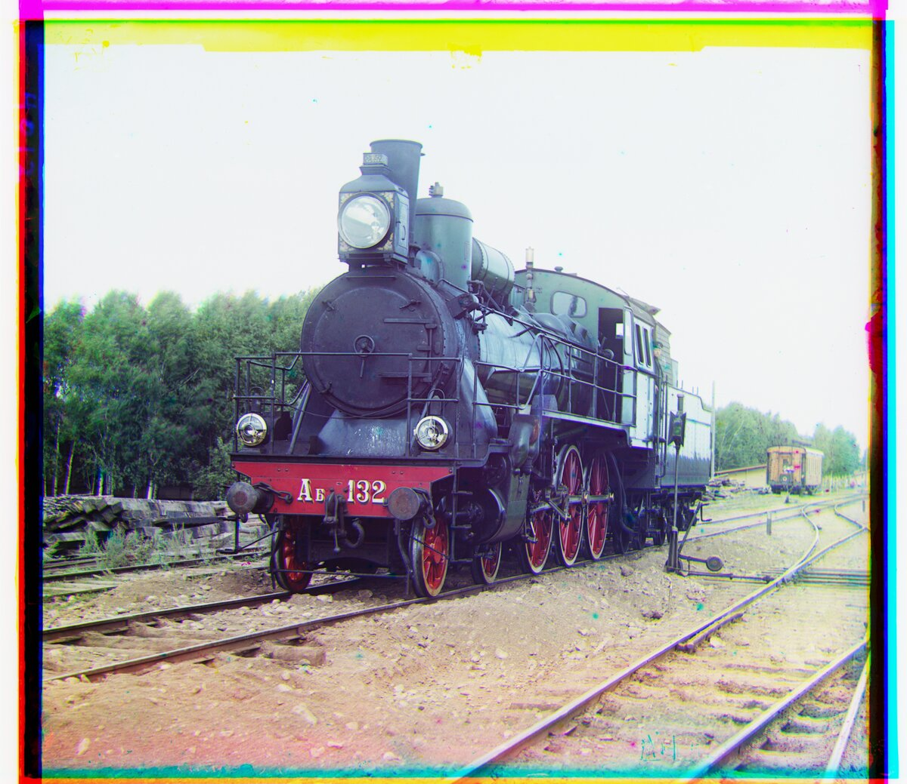<figcaption>Phase: G (7, 40), R (33, 84), 3.1 s, peaks 0.065 / 0.070</figcaption></figure>

#### 01657u (full-size)

  <figure><figcaption>Sobel edges</figcaption></figure>
  <figure><figcaption>Phase: G (8, 55), R (11, 117), 3.5 s, peaks 0.058 / 0.027</figcaption></figure>

#### 01725u (full-size)

  <figure><figcaption>Sobel edges</figcaption></figure>
  <figure><figcaption>Phase: G (46, 76), R (79, 162), 3.7 s, peaks 0.049 / 0.047</figcaption></figure>

Observations:

- All 18 plates align. The offsets are within 3 px of the Sobel pyramid in section 5, and in full-resolution crops both look sharp, with slightly more fringing on 00458u.
- A full-size plate takes about 3.2 s including edge detection, half the time of the Sobel pyramid with NCC (6.1 s). The alignment step alone is about 1.6 s.

### Canny

#### 00056v

  <figure><figcaption>Canny edges</figcaption></figure>
  <figure><figcaption>Phase: G (1, 5), R (1, 12), 0.1 s, peaks 0.177 / 0.167</figcaption></figure>

#### 00804v

  <figure><figcaption>Canny edges</figcaption></figure>
  <figure>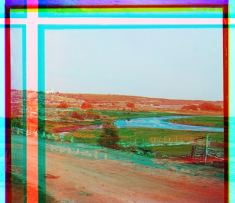<figcaption>Phase: G (-3, 6), R (52, 41), 0.0 s, peaks 0.147 / 0.079</figcaption></figure>

#### 31421v

  <figure><figcaption>Canny edges</figcaption></figure>
  <figure>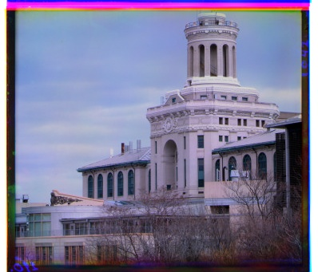<figcaption>Phase: G (0, 8), R (0, 13), 0.0 s, peaks 0.420 / 0.334</figcaption></figure>

#### 00458u (full-size)

  <figure><figcaption>Canny edges</figcaption></figure>
  <figure><figcaption>Phase: G (7, 40), R (32, 86), 4.7 s, peaks 0.029 / 0.032</figcaption></figure>

#### 01657u (full-size)

  <figure><figcaption>Canny edges</figcaption></figure>
  <figure><figcaption>Phase: G (8, 55), R (11, 108), 5.1 s, peaks 0.022 / 0.012</figcaption></figure>

#### 01725u (full-size)

  <figure><figcaption>Canny edges</figcaption></figure>
  <figure><figcaption>Phase: G (47, 77), R (79, 162), 5.4 s, peaks 0.040 / 0.031</figcaption></figure>

Observations:

- Three plates fail: 00804v (red at (52, 41)), 01269v (red at (7, 23)), and 01657u (red 9 px off). Phase correlation depends on a single global peak, so Canny's sparse edges that don't overlap between channels hurt it even more than they hurt the pyramid.
- The failures have low red peaks (0.012 to 0.079), but so do some correct full-size plates (0.027 for 01657u with Sobel), because the peak shrinks as the image gets bigger. The peak only works as a confidence score between images of the same size.

## 7. Results

Mean and median offsets and time for each alignment method, over the six plates shown on this page, in two tables. Each table only includes the methods whose images are shown for those plates. The small and full-size plates are summarized separately, because their offsets and run times differ by an order of magnitude. Offsets are (x, y) in pixels. Times are per plate for aligning both channels, including edge detection.

### Small plates (00056v, 00804v, 31421v)

| Method | G mean | G median | R mean | R median | Time mean | Time median |
|--------|--------|----------|--------|----------|-----------|-------------|
| Single-scale L2 | (-0.3, 6.7) | (0, 6) | (-1.0, 13.0) | (0, 13) | 0.49 s | 0.45 s |
| Single-scale NCC | (-0.3, 6.7) | (0, 6) | (-1.0, 13.0) | (0, 13) | 1.29 s | 1.21 s |
| Sobel edges, pyramid L2 | (-0.3, 6.3) | (0, 6) | (-1.0, 13.3) | (0, 13) | 0.50 s | 0.51 s |
| Sobel edges, pyramid NCC | (-0.3, 6.3) | (0, 6) | (-1.0, 13.3) | (0, 13) | 1.16 s | 1.16 s |
| Canny edges, pyramid L2 | (-0.3, 6.3) | (0, 6) | (-1.3, 13.0) | (0, 13) | 0.52 s | 0.53 s |
| Canny edges, pyramid NCC | (-0.3, 6.3) | (0, 6) | (-1.3, 13.0) | (0, 13) | 1.17 s | 1.16 s |
| Phase correlation, Sobel | (-0.3, 6.3) | (0, 5) | (-1.0, 13.3) | (0, 13) | 0.05 s | 0.03 s |
| Phase correlation, Canny | (-0.7, 6.3) | (0, 6) | (17.7, 22.0) | (1, 13) | 0.04 s | 0.04 s |

### Full-size plates (00458u, 01657u, 01725u)

| Method | G mean | G median | R mean | R median | Time mean | Time median |
|--------|--------|----------|--------|----------|-----------|-------------|
| Pyramid L2 | (19.7, 58.3) | (8, 55) | (40.3, 121.0) | (32, 114) | 2.34 s | 2.34 s |
| Pyramid NCC | (20.0, 57.7) | (9, 54) | (40.7, 121.3) | (32, 116) | 4.44 s | 4.44 s |
| Sobel edges, pyramid L2 | (20.3, 58.3) | (9, 55) | (41.0, 121.3) | (33, 117) | 3.99 s | 3.98 s |
| Sobel edges, pyramid NCC | (20.3, 58.3) | (9, 55) | (41.0, 121.3) | (33, 117) | 6.11 s | 6.08 s |
| Canny edges, pyramid L2 | (20.7, 57.3) | (9, 56) | (41.0, 121.7) | (34, 120) | 5.71 s | 5.74 s |
| Canny edges, pyramid NCC | (20.7, 57.3) | (9, 56) | (41.0, 121.7) | (34, 120) | 7.86 s | 7.84 s |
| Phase correlation, Sobel | (20.3, 57.0) | (8, 55) | (41.0, 121.0) | (33, 117) | 3.44 s | 3.53 s |
| Phase correlation, Canny | (20.7, 57.3) | (8, 55) | (40.7, 118.7) | (32, 108) | 5.07 s | 5.15 s |

With only three plates per table, the gap between the mean and the median mostly reflects how different the plates are, so compare methods row against row rather than mean against median. The misalignments still stand out:

- Canny edges with phase correlation misaligns 00804v (red at (52, 41)). That pulls the small-plate red mean to (17.7, 22.0), while every other method gives about (-1, 13).
- It also puts the red channel of 01657u 9 px off. That plate is the median of the full-size table, so the red median drops to 108, against 114 to 120 for the other methods.
- Every other method aligned all of the plates shown.

### Best method

**Alignment.** Sobel edges with the pyramid gives the best alignment.

- It aligned every plate shown.
- Its L2 and NCC offsets are identical on all of them.
- In full-resolution crops of 01657u it is visibly cleaner than the brightness-based pyramid. The brightness-based pyramid leaves a cyan fringe along the dress and fingers and a magenta halo around dust specks, from a red channel about 3 px off. On 00458u the two are indistinguishable.
- Phase correlation on Sobel edges lands within 1 to 3 px of it, but shows slightly more fringing on 00458u.
- Canny with phase correlation misaligns 00804v and 01657u outright, and Canny with the pyramid lands 1 to 3 px off Sobel on the full-size plates.

**Speed.** On the full-size plates:

- The brightness-based pyramid with L2 is the fastest method overall at 2.3 s per plate, because it needs no edge detection.
- Phase correlation has the fastest alignment step (about 1.8 s), but Sobel edge detection brings it to 3.4 s.
- The Sobel pyramid with L2 takes 4.0 s.
- NCC roughly doubles the alignment time in every method.

On the small plates every method takes about a second or less, and phase correlation is about ten times faster than the rest (0.03 to 0.05 s, against 0.5 s or more).

**Overall.** Sobel edges with the pyramid and L2 is the best choice: the most accurate alignment, for 1.7 s more per full-size plate than the fastest method. It is the input for the bells & whistles in sections 8 to 11. If speed matters more than the last few pixels, the brightness-based pyramid with L2 is the fastest method that still aligned every plate.

## 8. Auto-Cropping

Sections 8 to 11 are the bells & whistles. Each has its own script, and all four start from the best alignment found above: Sobel edges with the pyramid and L2 (see section 7). Contrast, white balance, and colour mapping all run on the auto-cropped image, so the borders don't skew their statistics.

After alignment, each channel's plate border (a black frame, with the white scanner margin outside it) sits in a different place, which leaves coloured strips around the image. `auto_crop.py` scans inward from each side, looking at most 12% of the way in, and marks a row or column as border when either of these holds:

- **The channels disagree:** the mean of max minus min across R, G, and B is above 0.5. Inside the photo it is typically 0.15 to 0.27.
- **One channel is its black frame:** more than 80% of the row is dark (below 0.2) in any one channel.

It cuts through the last border row, stops once 2% of the side in a row is clean, and adds a 1% margin. It also always removes the rows and columns that wrapped around when the channels were shifted.

This follows the hint in the assignment: inside the photo the three channels agree, while at the borders they don't. Detecting that difference adapts to each plate, instead of cutting a fixed margin. The 80% dark requirement is what separates a frame from dark picture content: a dark dress or a wooden wall covers at most about 70% of a row, while a frame covers 80 to 100%. Cut sizes are in full-resolution pixels.

#### 00056v

  <figure><figcaption>Aligned</figcaption></figure>
  <figure>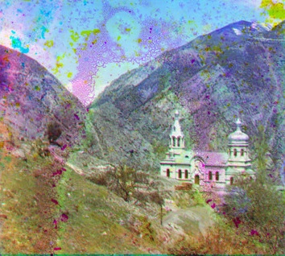<figcaption>Auto-cropped: cut top 15, bottom 8, left 26, right 18 px</figcaption></figure>

#### 00804v

  <figure><figcaption>Aligned</figcaption></figure>
  <figure>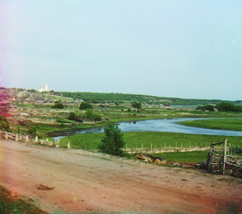<figcaption>Auto-cropped: cut top 23, bottom 6, left 22, right 22 px</figcaption></figure>

#### 31421v

  <figure>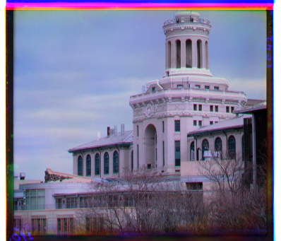<figcaption>Aligned</figcaption></figure>
  <figure>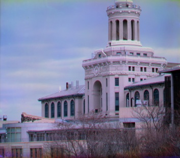<figcaption>Auto-cropped: cut top 17, bottom 13, left 22, right 23 px</figcaption></figure>

#### 00458u (full-size)

  <figure><figcaption>Aligned</figcaption></figure>
  <figure>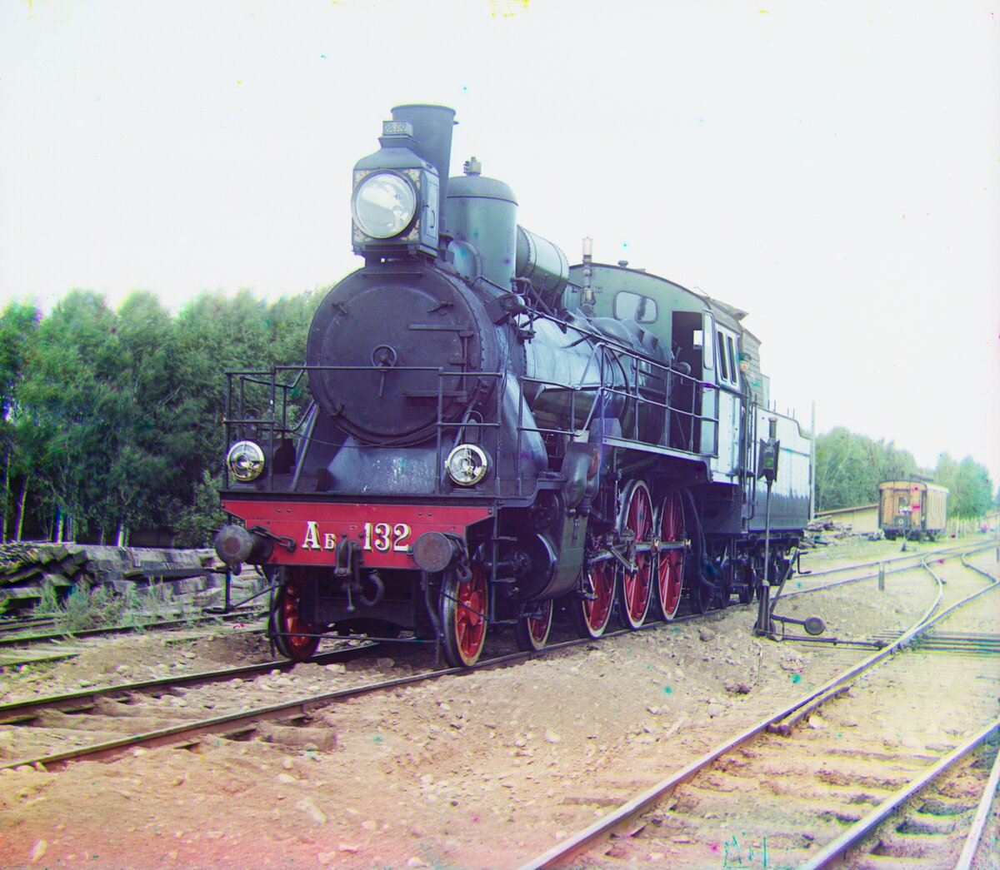<figcaption>Auto-cropped: cut top 228, bottom 87, left 214, right 171 px</figcaption></figure>

#### 01657u (full-size)

  <figure><figcaption>Aligned</figcaption></figure>
  <figure><figcaption>Auto-cropped: cut top 233, bottom 42, left 215, right 164 px</figcaption></figure>

#### 01725u (full-size)

  <figure><figcaption>Aligned</figcaption></figure>
  <figure>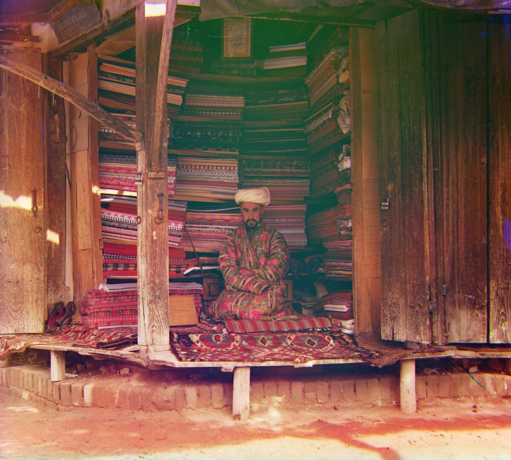<figcaption>Auto-cropped: cut top 246, bottom 33, left 255, right 195 px</figcaption></figure>

## 9. Auto-Contrast

`auto_contrast.py` works in two steps:

1. **Linear stretch.** Map the 0.5th percentile of all pixel values to black and the 99.5th percentile to white, using one range for all three channels. Percentiles, rather than the minimum and maximum, keep a few specks of dust or scratches from setting the range. A shared range keeps the colour balance unchanged.
2. **CLAHE** (contrast-limited adaptive histogram equalization, `skimage.exposure.equalize_adapthist`) on the lightness channel of CIELAB. It equalizes the histogram in small tiles, so each region uses the full tonal range. The clip limit (0.01) caps how much any tone can be stretched, which keeps noise and halos down. Working on lightness only leaves the colours alone.

The scans are flat: after cropping, the values span only about 0.06 to 0.96, and most of the image sits in the middle tones. The stretch fixes the range, and CLAHE brings out local detail (clouds, foliage, the track ballast) that a single global curve can't.

#### 00056v

  <figure><figcaption>Auto-cropped</figcaption></figure>
  <figure>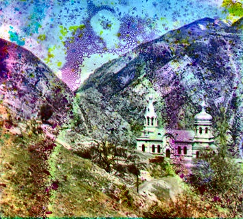<figcaption>Auto-contrast: range [0.10, 0.98] stretched</figcaption></figure>

#### 00804v

  <figure><figcaption>Auto-cropped</figcaption></figure>
  <figure>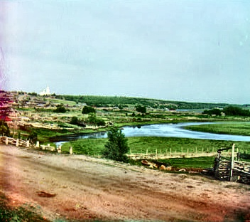<figcaption>Auto-contrast: range [0.10, 0.95] stretched</figcaption></figure>

#### 31421v

  <figure><figcaption>Auto-cropped</figcaption></figure>
  <figure>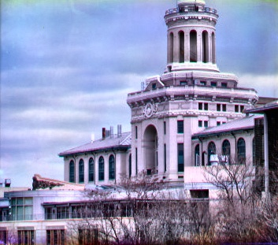<figcaption>Auto-contrast: range [0.02, 0.85] stretched</figcaption></figure>

#### 00458u (full-size)

  <figure><figcaption>Auto-cropped</figcaption></figure>
  <figure>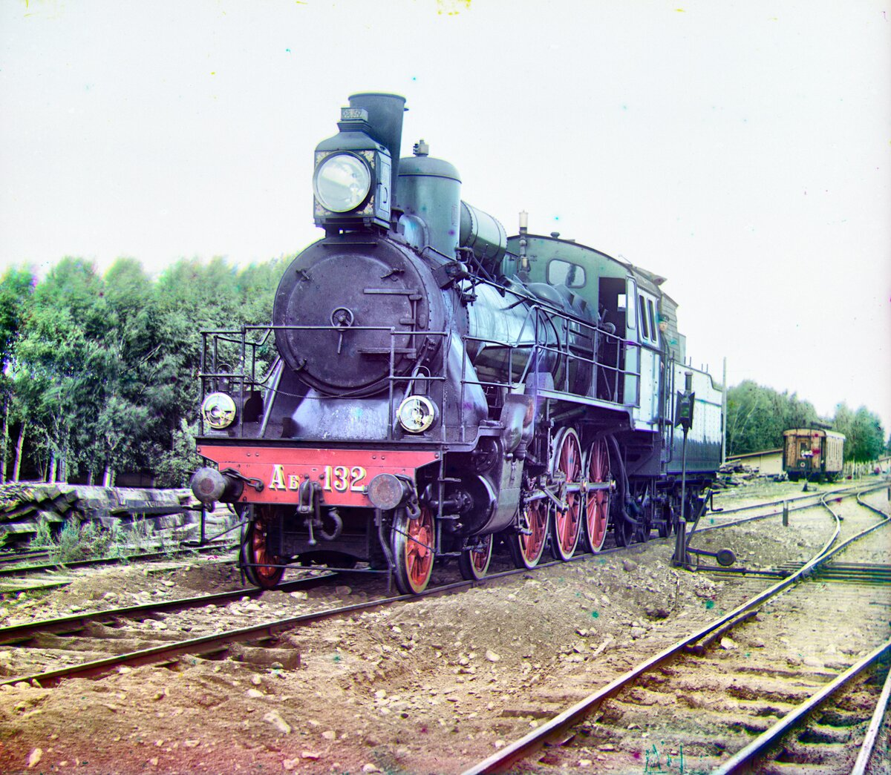<figcaption>Auto-contrast: range [0.07, 0.96] stretched</figcaption></figure>

#### 01657u (full-size)

  <figure><figcaption>Auto-cropped</figcaption></figure>
  <figure>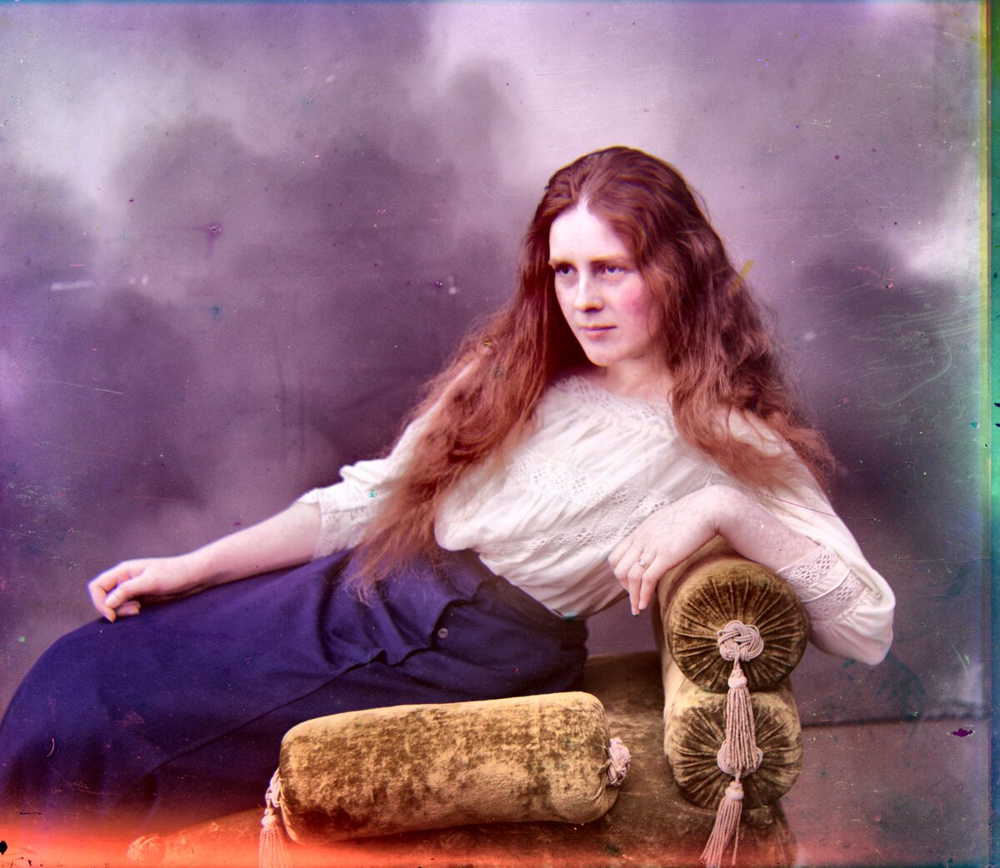<figcaption>Auto-contrast: range [0.06, 0.95] stretched</figcaption></figure>

#### 01725u (full-size)

  <figure><figcaption>Auto-cropped</figcaption></figure>
  <figure>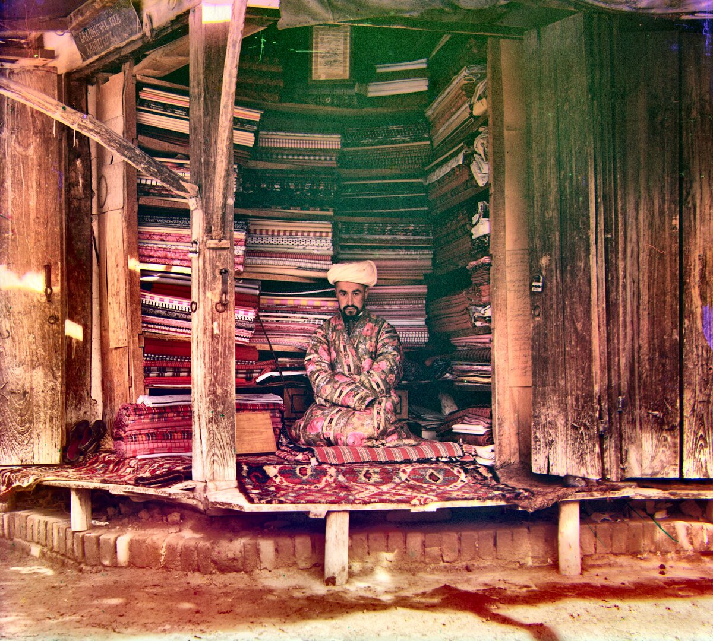<figcaption>Auto-contrast: range [0.06, 0.96] stretched</figcaption></figure>

## 10. Auto White Balance

`auto_white_balance.py` estimates the colour of the light (the illuminant) and divides it out. The illuminant is estimated with shades of gray (Finlayson and Trezzi, 2004), as a power mean of each channel over all N pixels:

$$ e_c = \Big( \frac{1}{N} \sum_{x} I_c(x)^p \Big)^{1/p} $$

Each channel is then multiplied by $$ \bar{e} / e_c $$, which makes the estimate neutral gray (a von Kries diagonal correction). With p = 1 this is the gray world assumption (the average colour of a scene is gray). As p grows it approaches white patch (the brightest colour is white). The script uses p = 6, in between, which copes better with both large single-coloured areas and a few bright highlights.

Each exposure was made through a different filter onto a plate with a different sensitivity, so the channels come out unbalanced. 01725u, for example, comes out strongly red. Scaling each channel is the simplest correction; the hard part is estimating the illuminant, and shades of gray is a simple estimator that works well in practice.

#### 00056v

  <figure><figcaption>Auto-cropped</figcaption></figure>
  <figure><figcaption>White balance: gains R 1.08, G 1.02, B 0.91</figcaption></figure>

#### 00804v

  <figure><figcaption>Auto-cropped</figcaption></figure>
  <figure>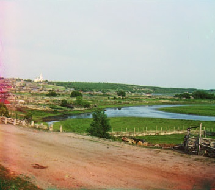<figcaption>White balance: gains R 1.08, G 0.98, B 0.95</figcaption></figure>

#### 31421v

  <figure><figcaption>Auto-cropped</figcaption></figure>
  <figure>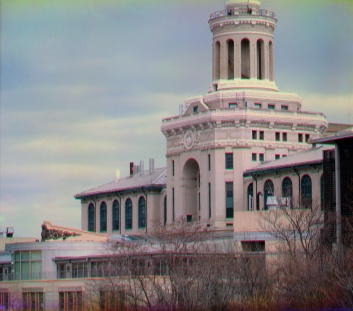<figcaption>White balance: gains R 1.10, G 1.07, B 0.87</figcaption></figure>

#### 00458u (full-size)

  <figure><figcaption>Auto-cropped</figcaption></figure>
  <figure>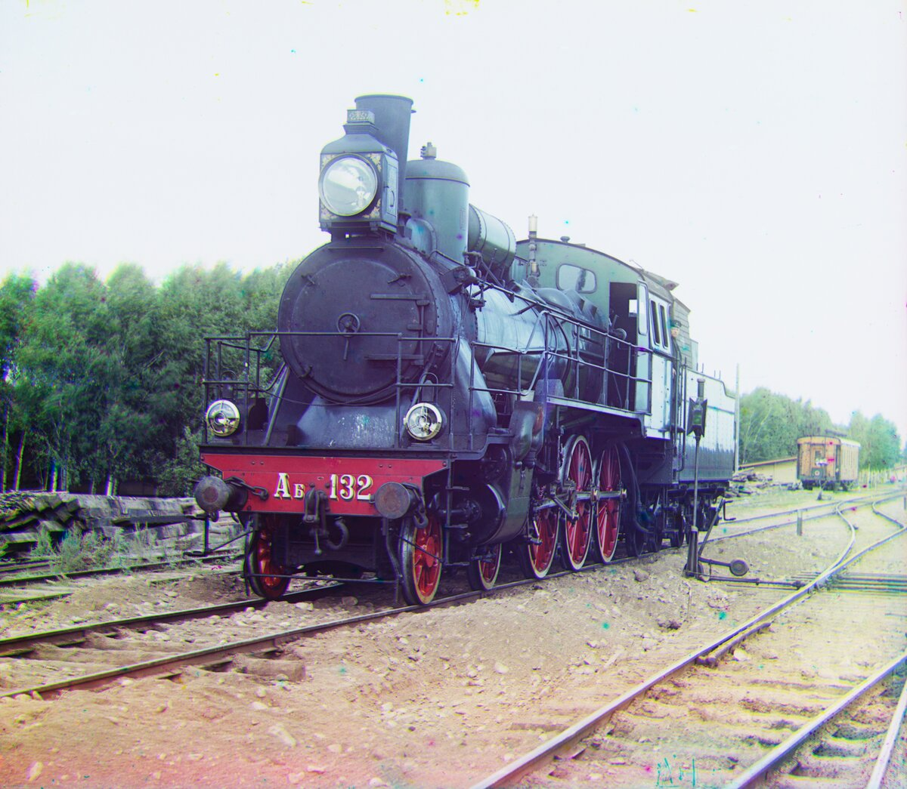<figcaption>White balance: gains R 0.99, G 1.00, B 1.01</figcaption></figure>

#### 01657u (full-size)

  <figure><figcaption>Auto-cropped</figcaption></figure>
  <figure>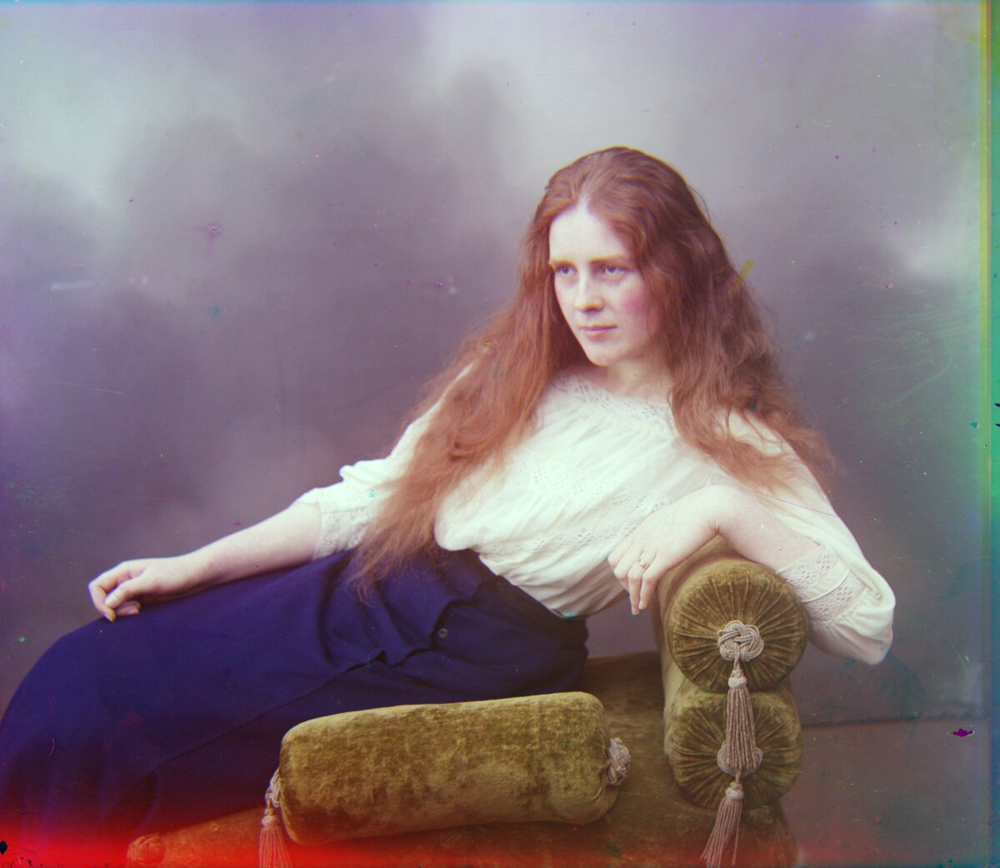<figcaption>White balance: gains R 0.94, G 1.08, B 0.99</figcaption></figure>

#### 01725u (full-size)

  <figure><figcaption>Auto-cropped</figcaption></figure>
  <figure>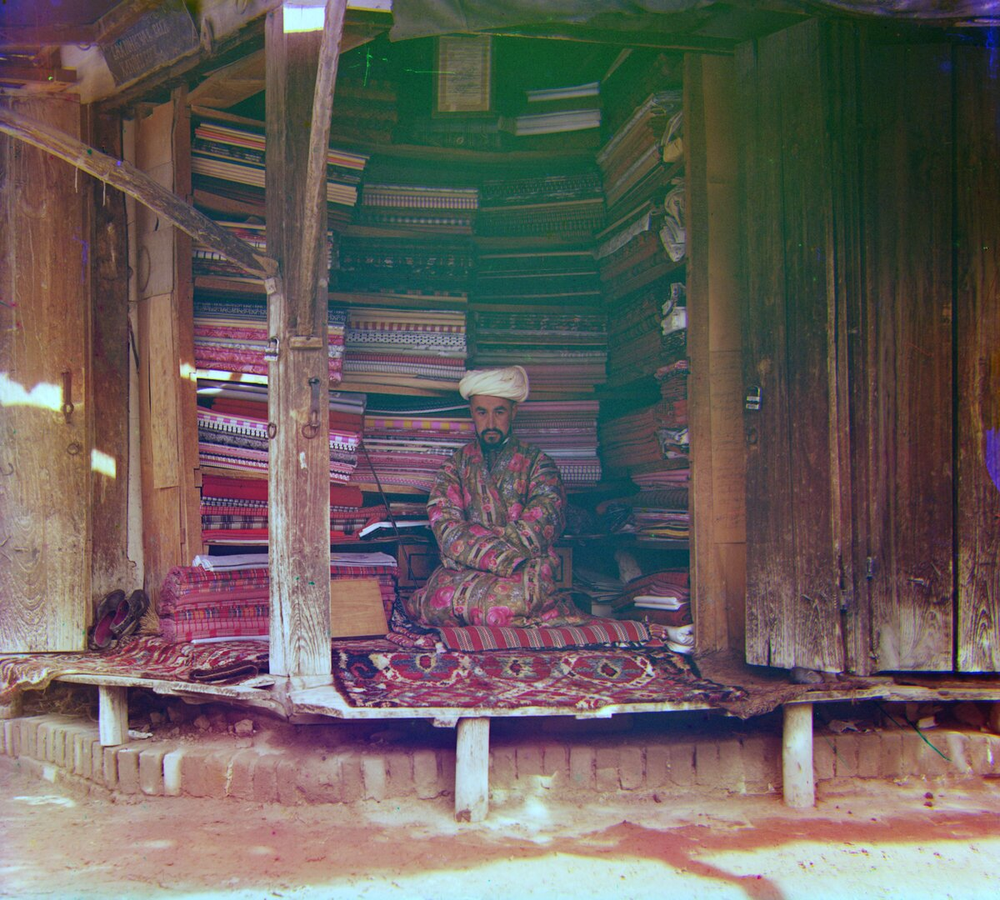<figcaption>White balance: gains R 0.82, G 1.04, B 1.21</figcaption></figure>

## 11. Auto Colour Mapping

Prokudin-Gorskii's filters were not the sRGB primaries, and neighbouring filters overlap in the spectrum: the green exposure also records some blue and red light, and so on. Each recorded channel is therefore a mix of the true ones, which washes the colours out. `auto_colour_map.py` models this with a mixing matrix in which red and green, and green and blue, share a fraction e of their light (red and blue don't overlap):

$$ \begin{bmatrix} R' \\ G' \\ B' \end{bmatrix} = \begin{bmatrix} 1-e & e & 0 \\ e & 1-2e & e \\ 0 & e & 1-e \end{bmatrix} \begin{bmatrix} R \\ G \\ B \end{bmatrix} $$

It then applies the inverse matrix. Each row sums to 1, so grays stay gray, and the inverse has negative off-diagonal terms that subtract the leaked light, which is what a camera's colour correction matrix does. The leakage is chosen per image: the script tries e from 0 to 0.3 and keeps the largest value that pushes at most 0.5% of pixels outside the displayable range.

It runs after white balance, as in a camera pipeline, because the correction exaggerates colour differences from gray and would also exaggerate an uncorrected colour cast.

This recovers colour separation that the overlapping filters lost (greener fields and a bluer river on 00804v) without needing a reference image. On 00056v the chosen leakage is 0: the plate's damage already contains strongly saturated blotches, so any correction would clip too many pixels. The true filter curves are unknown, so the symmetric leakage model is an approximation.

#### 00056v

  <figure><figcaption>White balanced</figcaption></figure>
  <figure>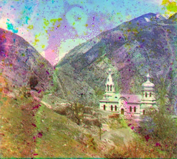<figcaption>Colour mapped: leak 0.00</figcaption></figure>

#### 00804v

  <figure><figcaption>White balanced</figcaption></figure>
  <figure>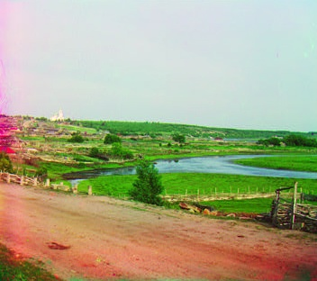<figcaption>Colour mapped: leak 0.18</figcaption></figure>

#### 31421v

  <figure><figcaption>White balanced</figcaption></figure>
  <figure>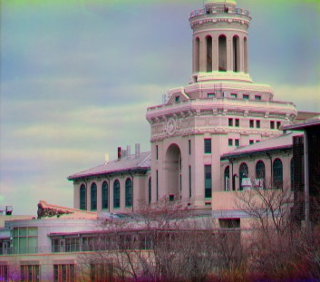<figcaption>Colour mapped: leak 0.12</figcaption></figure>

#### 00458u (full-size)

  <figure><figcaption>White balanced</figcaption></figure>
  <figure>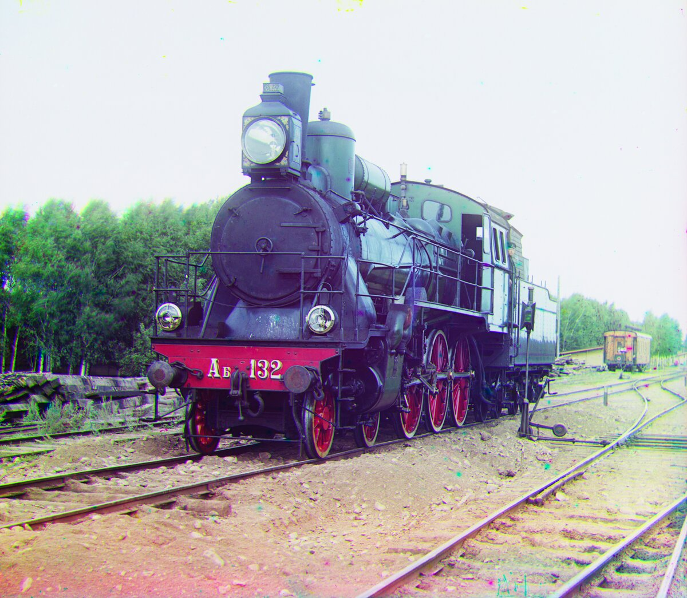<figcaption>Colour mapped: leak 0.11</figcaption></figure>

#### 01657u (full-size)

  <figure><figcaption>White balanced</figcaption></figure>
  <figure><figcaption>Colour mapped: leak 0.05</figcaption></figure>

#### 01725u (full-size)

  <figure><figcaption>White balanced</figcaption></figure>
  <figure>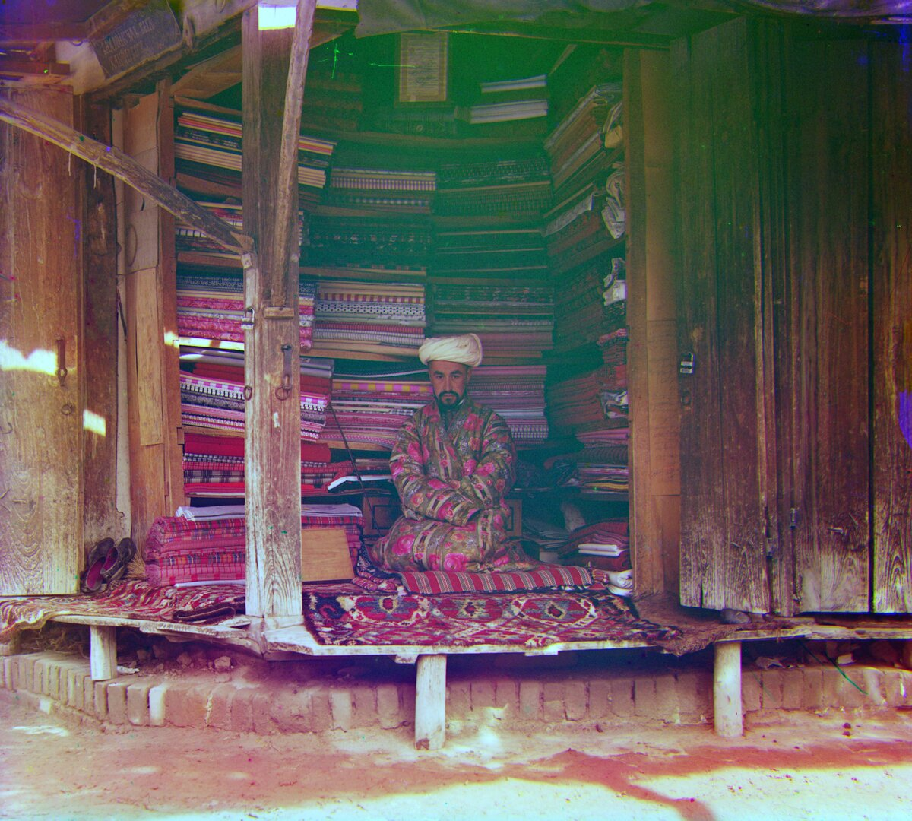<figcaption>Colour mapped: leak 0.08</figcaption></figure>

<!--
Still to write:

## Part 1: Becoming Friends with Your Camera
### Selfie: The Wrong Way vs. The Right Way
### Architectural Perspective Compression
-->
